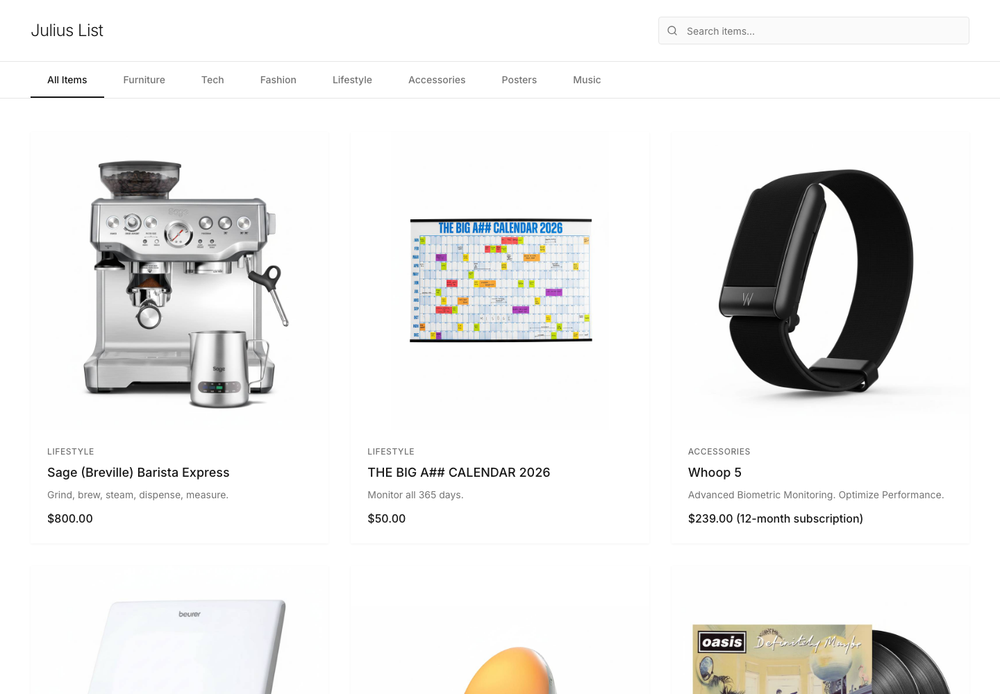
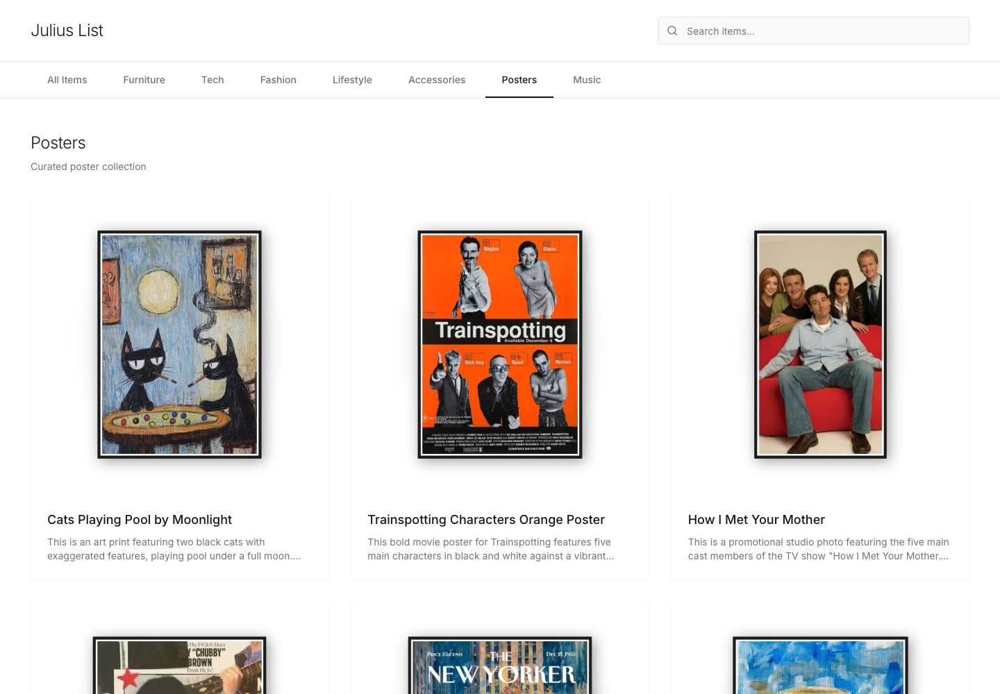
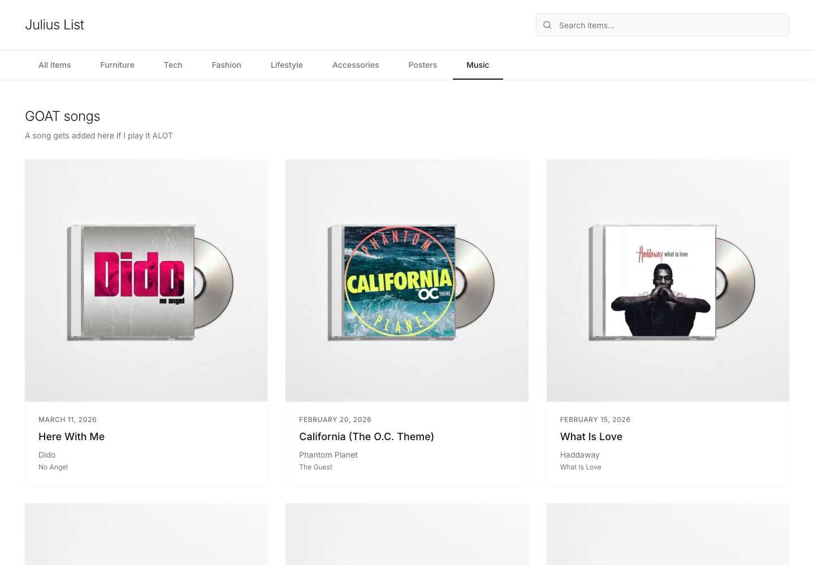
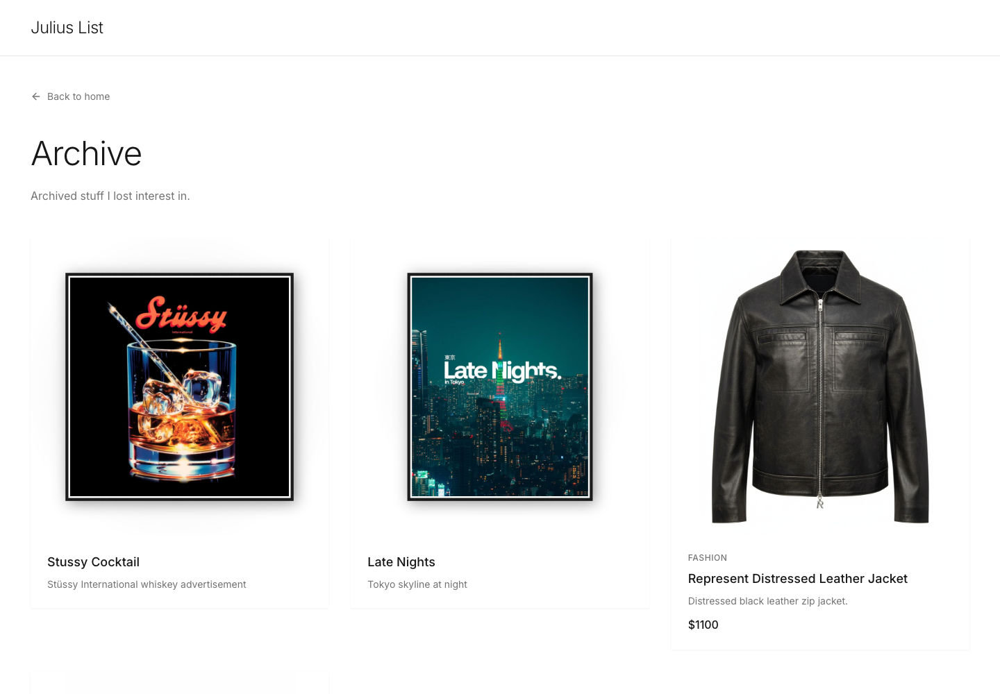

# Minimal List Site

[](https://nextjs.org/)
[](https://www.typescriptlang.org/)
[](https://www.prisma.io/)
[](LICENSE)

A clean personal list template for things you like, want to buy, or want to keep track of. Inspired by [Curated Supply](https://www.curated.supply/), with a plain black-and-white design that is easy to make your own.

My own site using this template is [juliuslist.com](https://juliuslist.com).



## Why It Is Useful

Most personal list sites are either too generic or too much work to maintain. This template is a practical middle ground: a public list, posters, music, a private admin, image uploads, archive support, and optional AI helpers.

The AI parts are opt-in. Leave `NEXT_PUBLIC_ENABLE_AI=false` and it behaves like a normal CMS. Turn AI on and the admin can help with:

- **Background removal / studio images**: clean up messy product photos into white-background listing images.
- **Image filling and framing**: normalize uploads into consistent square cards.
- **Listing copy**: draft a title, tagline, price formatting, and description from an image and a few details.
- **Poster processing**: frame poster uploads consistently while preserving the original.

## Screenshots

| Home | Posters |
| --- | --- |
|  |  |

| Music | Archive |
| --- | --- |
|  |  |

## Features

- Public item collection with categories and search
- Optional poster collection
- Optional music collection
- Archive page for old or hidden entries
- Password-protected admin dashboard
- Local uploads by default, Supabase Storage for production
- Optional OpenRouter AI helpers with Gemini fallback
- Env-based site name, owner, description, about copy, bucket, and feature flags
- Vercel-ready Next.js app

## Stack

Next.js App Router, React, TypeScript, Tailwind CSS, Prisma, SQLite locally, Postgres/Supabase for production, and NextAuth.

## Quick Start

```bash
pnpm run setup:local
pnpm dev
```

Open `http://localhost:3000`.

This uses SQLite and local file uploads by default. Full setup notes are in [docs/setup.md](docs/setup.md), and agent-specific setup guidance is in [instructions.md](instructions.md).

## Feature Flags

| Variable | Default | Purpose |
| --- | --- | --- |
| `NEXT_PUBLIC_ENABLE_POSTERS` | `true` | Shows the poster collection and admin poster tools. |
| `NEXT_PUBLIC_ENABLE_MUSIC` | `true` | Shows the music collection and admin music tools. |
| `NEXT_PUBLIC_ENABLE_AI` | `false` | Shows AI item creation and AI image cleanup controls. |

## Scripts

```bash
pnpm dev          # Start local dev server with NODE_ENV=development
pnpm build        # Build for production
pnpm setup:local  # Install deps, create/update local SQLite DB, and seed demo content
pnpm lint         # Run ESLint
pnpm typecheck    # Run TypeScript
pnpm audit --prod # Check production dependency advisories
pnpm db:setup     # Create/update local SQLite DB and seed demo content
pnpm db:push      # Push the local SQLite schema
pnpm db:seed      # Seed admin user and demo content
```

## License

MIT
